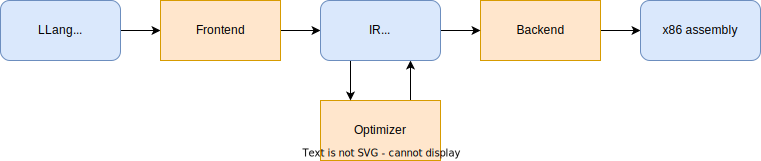
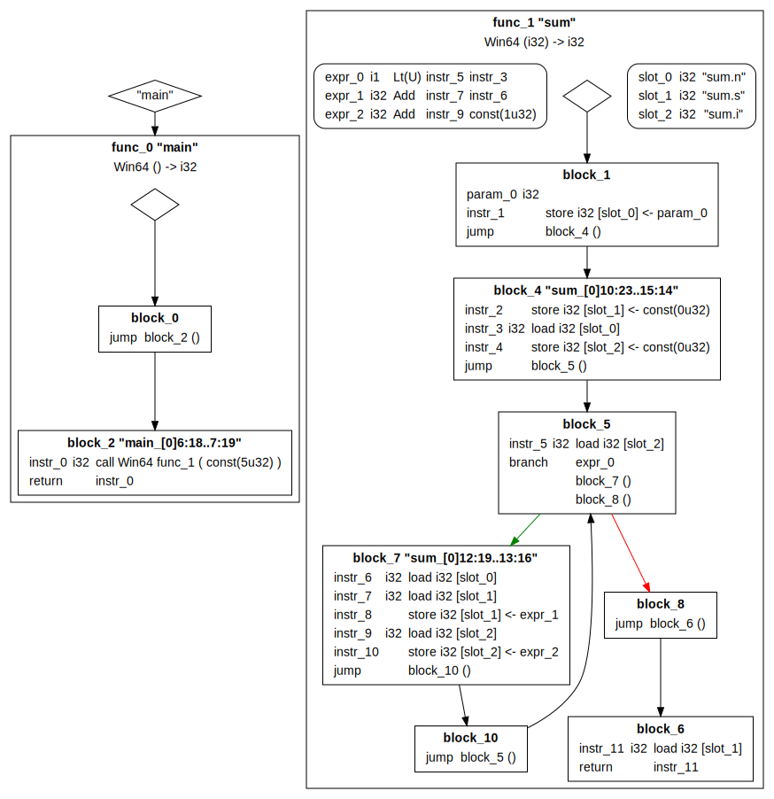

# lllang-rs

A compiler for a C-like language, going all the way from source code to x86-64 assembly. The compiler itself is written in Rust.

## Overview

The compiler follows the typical separation seen in many modern compilers.



First, the frontend parses source code, does type checking, symbol resolution and emits code in a simple, strongly typed intermediate representation (IR). Different frontends can be built for different languages while fully reusing the rest of the compiler.

The IR can optionally be modified by the optimizer, to minimize the execution time of the program. The IR is designed so it's easy to implement optimization passes.

Finally the backend lowers the IR into assembly. Again, multiple backends could be implemented for different hardware architectures. The single backend currently implemented is for x86-64 with the Windows ABI.

## Details

### LLLang language

The frontend language supported by this compiler has syntax inspired from Rust, but the semantics are simpler, mostly C-like.

A shortlist of language features:
* Built-in types: signed and unsigned integer types, pointers, arrays, tuples, functions
* Code organisation: Functions, structures, modules, constants, statics, type aliases
* Type inference: full [Hindley–Milner](https://en.wikipedia.org/wiki/Hindley%E2%80%93Milner_type_system)-style bidirectional type inference.
* Statements: declarations, assignments, if statements, while and for loops
* Expressions: binary and unary operators, function calls, casting, the ternary operator `c ? x : y`, logical operators, struct and array literals, ...
* FFI: `extern` functions can be declared and used to call external libraries, this is used to implement a simple standard library that uses the [Win32 API](https://learn.microsoft.com/en-us/windows/win32/api/). 

A simple example program is shown below.

[//]: # (TODO write example program that shows all language features)

```rust
fn main() -> u32 {
    return sum(5);
}

fn sum(n: u32) -> u32 {
    let s = 0;
    for i in 0..n {
        s += n;
    }
    return s;
}
```

### IR representation

[//]: # (TODO actually talk about IR, maybe put LLVM differences in a different section?)
[//]: # (TODO talk about rust arena allocators? or is that too language-specific)

The Intermediate Representation (IR) takes a lot of inspiration from [LLVM IR](https://llvm.org/docs/LangRef.html), with some deviations:

* Instead of Phi instructions block parameters and target arguments are used. This concept is also used in the [Cranelift](https://cranelift.dev/) compiler. Similarly function parameters are not a separate value class, they're just the parameters of the entry block of the function.
* No stack allocation with `alloca`, instead slots are used. This simplifies backend code generation, since all necessary stack allocation is statically predefined for each function.
* Expressions that don't have any side effects are free-floating, not part of the basic block instruction lists. This is similar to the [Sea of Nodes](https://darksi.de/d.sea-of-nodes/) concept, except that basic blocks are still used for control flow and side effects. This reduces the number of equivalent representations a program can have, which  means optimization passes need to match fewer patterns, less canonicalization passes are necessary.
* Untyped pointers are used, inspired by the recent [LLVM switch](https://llvm.org/docs/OpaquePointers.html) to them. Since pointer casts don't have any semantics, we again reduce redundancies by making them completely obsolete.  

The (unoptimized) IR corresponding to the "sum" program above is shown below.



### Frontend: Source code to IR

The frontend consists of multiple steps, shown in the diagram below.


First, the collection of source code files is parsed into a module tree, with an AST (Abstract Syntax Tree) for each module. Parsing uses the typical two-step process of tokenization followed by the main parser. The parser is implemented using handwritten [Recursive Descent](https://en.wikipedia.org/wiki/Recursive_descent_parser), with expressions and their precedences being handled by [Pratt Parsing](https://matklad.github.io/2020/04/13/simple-but-powerful-pratt-parsing.html). This combination makes for a very readable and maintainable parser. 

The next step is name and type resolution. Here identifiers that represent types or global values are resolved, struct definitions and function signatures are parsed and constants and static variable are collected. During this step imports are resolved and module scopes are built.

The final step is lowering the AST to the IR, using the resolved symbols and types from the previous step. Constant and static global variables can directly be lowered. Function lowering requires type inference and so happens in 3 steps:

* Walk the AST once, collect type constraints into a _TypeProblem_. These constraints are things like "this literal is an unsigned integer", "this variable and this function parameter have the same type", "this expression has this type".
* Solve the _TypeProblem_ by running [Hindley–Milner](https://en.wikipedia.org/wiki/Hindley%E2%80%93Milner_type_system)-style deductions until fixed point is reached and all expressions have been assigned a type.
* Walk the AST again, now emitting the right IR for each construct. Here the types inferred during the solving step are used.

### Middle: IR analysis and optimization

[//]: # (TODO talk about pass runner infrastructure? with analysis invalidation?)

#### Debugging Infrastructure

The _Renderer_ converts the IR graph to an svg image, using [Graphviz](https://graphviz.org/) for layout and rendering. This makes it really easy to see and reason about the control flow and all instructions, expressions, functions, and other components of the IR. Comparing the before/after graphs is a convenient way to debug and experiment with optimization passes. The figures showing the IR in the rest of this document have been produced by this renderer.

The _Verifier_ checks the IR for correctness and consistency. It checks whether instruction operations have the right types, whether function call arguments are correct, whether the SSA dominance property is respected and more. This step can be run before and after every IR optimization or transformation to quickly find many classes of bugs.

#### Analysis steps

To support the optimizations listed below, the following analysis algorithms are implemented:

* **Dominance Info** computes the basic block SSA [dominance](https://en.wikipedia.org/wiki/Dominator_(graph_theory)) information. This can be used to query information like:
    * What is the dominance frontier block `b`?
    * What are the predecessors of block `b`?
    * Is block `b1` reachable from block `b2`?

* **Usage info** computes the set of usages of each value. This is used in almost every optimization pass, primarily to replace values by simpler ones. It can also be used to check if values "escape" the function local context, how many times a value is used, whether a value is ever used as call target, ... These questions need to be answered a lot during optimizations, so this analysis information is very important.

* **Alias analysis** checks whether pointers and memory locations alias. It does this by checking their origins, if they're derived from a common base pointer with different offsets, if the type used to store and load to them is the same, etc. The results returned are not definitive, ie. "Unknown" or "Maybe partial overlap" are possible answers.

[//]: # (TODO separate pass runner chapter?)

The Dominance and Usage analysis steps can be expensive to run, so their results are cached by the pass execution framework. When an optimization changes the IR in a meaningful way it reports this to the framework, and the relevant cached data is invalidated and is recomputed when another pass requests it.

#### Optimization passes

The compiler implements the following optimization passes:

[//]: # (TODO give examples of each pass?)

* **Garbage collection (GC)**

    This pass cleans up the data structure used for storing the IR. It walks the entire graph, collecting all nodes that are still reachable from the roots, the externally visible symbols such as the `main()` function. It then removes any unreachable nodes from the data structure, reclaiming unused memory.

* **Dead code elimination (DCE)**

    Removes various kinds of redundant/"dead" items from the IR. Specifically it removes unused function/block parameters and their corresponding call/terminator arguments, unused function slots and instructions whose results is not used and that also don't have side effects. This pass does global analysis, so it can also remove items that are part of a cycle but are otherwise unused.

* [**Global value numbering (GVN)**](https://en.wikipedia.org/wiki/Value_numbering)

    Deduplicates expressions with identical operations and operands. Because of the "sea of nodes" we use for expressions, this pass is really simple. In theory the IR data structures could automatically and immediately deduplicate expressions during construction, but it's tricky since modifying expressions operands should re-trigger this deduplication.

* **Slot2Param conversion**: SSA construction, similar to the `mem2reg` pass in LLVM.

    The frontend uses _slots_ for local variables inside functions. This makes it really easy to generate code, since each assignment becomes a store to the slot and each usage becomes a load form the slot. This representation does not benefit from any advantages of the SSA representation though. This pass transforms IR in the slot/store/load format into proper SSA, using block parameters and terminator arguments. This can only happen for slots that are only used as load/store targets in the same function they're defined in, so the escape analysis from the _Usage Info_ pass is used to decide on which slot to apply the rewriting procedure.

* [**Sparse conditional constant propagation (SCCP)**](https://en.wikipedia.org/wiki/Sparse_conditional_constant_propagation)

    This pass is a combination of constant propagation and dead code elimination from constant branches that's strictly more powerful than running either optimization separately until fixpoint. The result of this optimization step is that values that can be proven constant are replaced by those constants, and blocks that are proven unreachable/dead can be removed. Branches with a constant condition can also be replaced with jumps.

    We implement a global/inter-procedural version of the algorithm that also reasons about function parameters and return values. The core algorithm is explained well in the [original paper](https://www.cs.wustl.edu/~cytron/531Pages/f11/Resources/Papers/cprop.pdf). It starts by assuming that no blocks are reachable and that all values are undefined. It then starts walking the graph from the entry points, gradually marking blocks as reachable and values as constants or as runtime-variable. This process runs until fixpoint. Finally values that have been proven constant or undefined can be replaced, and branches that depends on constant conditions can be replaced by a jump.

* **Function inlining**

    This pass _inlines_ functions into their callers. This removes function call and ABI overhead, at the cost of a potential increase in code size. More importantly, inlining allows other local/intra-procedural optimization passes to see much more context and so make better optimization decisions. 
  
    The figure below shows in a before/after IR graph of a function `f` being inlined into a calling function, with modified terminators in bold. The procedure involves splitting the calling block into two (blue), cloning the control flow graph of the called function (orange), replacing the call with a jump to the entry block and replacing all returns with jumps to the second half of the original calling block.

    

* **Instruction simplifying**

    This pass handles some miscellaneous simplifications peephole optimizations:
    * Instructions with undefined behavior are removed and replaced by a special _Unreachable_ block terminator.
    * Terminators with inverted conditions are flipped to remove the inversion. For example, `!c ? x : y` becomes `c ? y : x`.
    * Expressions are simplified and normalized, some major examples:
      * Simple expressions with a known result like `x - x` and `x >= x` are replaced by the result.
      * Associative expressions are rewritten to combine constants: `(x + c1) + c2` => `x + (c1 + c1)`.
      * Constants in commutative expressions are moved to the right to hopefully trigger the previous optimization more often: `c + x` => `x + c`.
      * Chains of bit casting operations are simplified to the shortest possible equivalent chain.

* **Memory forwarding**

    This pass replaces memory loads with the most recent store to the same target address. The pass can reason beyond a single basic block, and will insert block parameters to join multiple possible values if necessary. This pass extensively uses the _Alias Analysis_ described earlier.

    The algorithm starts at each load instruction, walking backwards though the basic block. Each encountered instruction is checked. If the instruction is store with a perfectly overlapping location, the stored value can be used. If the location _potentially_ matches, or the instruction is another instruction with potential side effects (eg. a function call) we don't have enough information and the search is aborted. If the start of the basic block is reached, a new block parameter is inserted and the search continues at each predecessor. The the search was aborted but on the way another matching load was found, its return value is reused instead.

    Care also needs to be taken to avoid cycles, by inserting temporary dummy values to break them. There is also some additional trickiness around how the search is aborted, since already made modifications have to be undone. All found memory values are cached at the start and end of blocks to avoid repeating work unnecessarily. 
  
* **Dead store elimination**

    This pass removes stores that are proven dead, meaning the stored value will be overwritten or never be loaded. The liveness analysis used is not limited to within a basic block, but walks through the control flow graph. 

    The algorithm is similar to the one used in memory forwarding, except that the direction of graph traversal is reversed, walking forward instead of backward through basic blocks and visiting successors instead of predecessors. It starts at each store instruction, walking forwards. If another store with the same location is encountered we know the original store is dead. If a potentially aliasing load is found we know the store is alive. If the end of the block is reached, we continue walking the successors.

    _Note_: currently this pass is just part of the memory forwarding pass, but it's a completely independent step and should be refactored into a separate pass.

* **Condition propagation**

    This pass uses information derived from branch conditions to simplify values. For example, in the "true" branch of an if-statement we know that the condition is true. If we then check the same condition again, it can just be replaced with the constant "true". This pass generalizes this idea: in all blocks _dominated by_ a branch (as computed by the dominance info analysis) we add the constraints `condition == true/false` depending on the side of the branch. If `condition` has the form `a == b` or `a != b` we also add those equalities as additional constraints. Operands of instructions in the dominated blocks are then simplified if any equality constraint applies.

* **Flow simplification**

    This pass simplifies the control flow graph. Some important simplifications it makes are:
    * jump to empty block -> terminator of that empty block, called 
    * Branch with constant condition -> jump
    * Branch with possible target block that has been marked unreachable -> jump to the other block

    These simplifications are also applied to the entry pointer of functions. 

* **Block threading**

    A variant of the of the earlier "jump to empty block" optimization that can also handle non-empty blocks by merging all instructions into a single block. For now this is only done when the merged blocks are not used elsewhere to prevent large code size increases, but this could be improved a lot. This pass should probably be merged with _flow simplification_ in the future.

* **Parameter combining**

    This pass combines block parameters that always get the same values as arguments.

* **Phi pushing** (Deprecated/Broken)


### Backend: IR to assembly

The backend is the part of the compiler that lowers the IR into the final output assembly that can be assembled into an executable. An overview is shown in the figure below, and some example code going through the backend process is shown at the bottom of this paragraph.


The first step is to lower the IR to another intermediate language _VCode_. This language has instructions corresponding to each final assembly instruction that will be emitted but also contains additional _virtual_ instructions to constrain the register allocation problem. The operands of VCode instructions are not yet the actual architecture registers, but placeholders virtual registers. This lowering also involves scheduling the sea-of-nodes expressions into basic blocks. Currently we always schedule all expressions used by each visited instruction immediately before the instruction. This is always correct but far from optimal, often emitting superfluous duplicate instructions. There's much room for improvement here.

On this VCode graph register allocation happens: deciding which architectural register gets assigned to each virtual register. The register allocation process can also insert register shuffling and spill code whenever necessary. We use the the [regalloc2](https://github.com/bytecodealliance/regalloc2) library from wasmtime to do register allocation. See also their excellent [Design Overview](https://github.com/bytecodealliance/regalloc2/blob/main/doc/DESIGN.md) for how it works internally.

Finally the VCode is lowered to assembly. Virtual instructions are dropped and virtual registers are replaced by their allocated architectural registers. The final output graph is flattened to assembly text.

```rust
fn add(x: &u8, y: &u8, n: isize) {
    for i in 0..n {
        *(x + i) += *(y + i);
    }
}
```


[//]: # (TODO?)
[//]: # (### Example program going through the pipeline)

### General compiler development resources

* The papers linked throughout the rest of this document are all pretty accessible. 
* [Crafting Interpreters](https://craftinginterpreters.com/), interpreters and compilers have very similar frontends and maybe even IRs!
* ["The Dragon book", Principles of Compiler Design](https://en.wikipedia.org/wiki/Principles_of_Compiler_Design). I agree with the common criticism that it focuses too much on lexing and parsing, but it's still a great introduction to compilers.
* The [Static Single Assignment book](https://pfalcon.github.io/ssabook/latest/book-full.pdf) for more information that anyone could ever want about SSA.
* [Combing Analyses, Combining Optimizations](https://scholarship.rice.edu/bitstream/handle/1911/96451/TR95-252.pdf), a great way to think about how to combine multiple optimizations passes into a single one to get a more powerful combination. Provides great intuition for SCCP and how to improve it even more. 
* The [LLVM Language Reference Manual](https://llvm.org/docs/LangRef.html) is a great to get some intuition on how to build an IR.
* [LLVM’s Analysis and Transform Passe](https://llvm.org/docs/Passes.html) is good source of inspiration for interesting optimization passes to implement.
* [Simple and Efficient Construction of Static Single Assignment Form](https://c9x.me/compile/bib/braun13cc.pdf) is an alternative, (online) SSA construction algorithm.